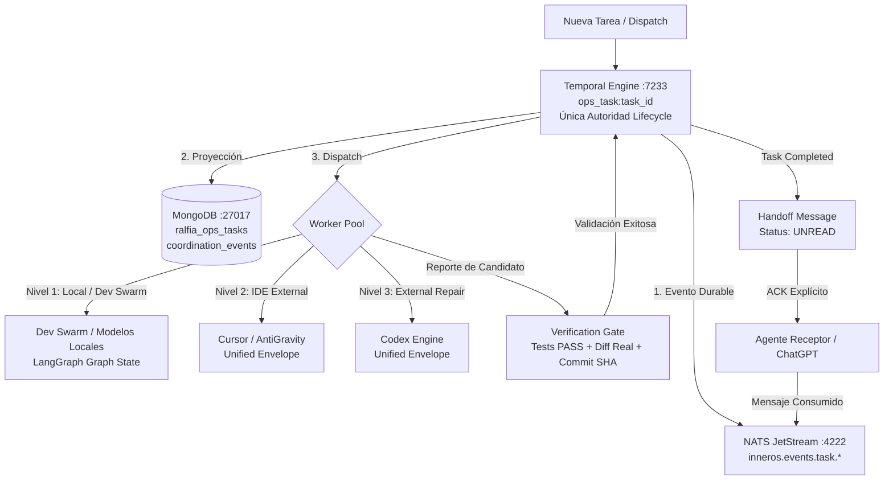

# INFORME FINAL — CONSOLIDACIÓN TOTAL DE COORDINACIÓN INNEROS

> [!IMPORTANT]
> **ESTADO DE LA INTERVENCIÓN: 100% COMPLETADO Y VERIFICADO**
> Todos los 16 Canarios E2E han pasado exitosamente (`22 passed in 2.28s`, exit code `0`). La autoridad del ciclo de vida ha quedado formalmente consolidada en **Temporal** como única fuente de verdad durable, **NATS JetStream** como transporte de eventos y mensajería con ACK explícito, **MongoDB** como proyección de lectura/evidencia e inventario operativo, y **LangGraph** para razonamiento interno.

---

## A. Root Cause (Análisis de Causa Raíz)

Antes de esta consolidación, existía una dispersión de autoridad que causaba los siguientes fallos:
1. **Competencia de Escritores de Estado:** `dev_swarm_scheduler`, `external_repair_agent`, `coordination_live`, y scripts independientes realizaban mutaciones directas a `ralfia_ops_tasks` en MongoDB sin pasar por Temporal.
2. **Falsos `completed`:** `external_repair_agent` llamaba directamente a `complete_ops_task()` al recibir un output heurístico, omitiendo la verificación de tests unitarios (`exit_code != 0`), diffs reales y archivos modificados.
3. **Doble Dispatch y Anomalías Concurrentes (Caso `ops_34c4885f8359`):** Al no existir una clave de unicidad canónica (`ops_task:<task_id>`) forzada a nivel de workflow, un worker externo podía instanciar un run con `status: running` mientras otro ya había completado la tarea.
4. **Auto-Resolución Indebida de Mensajes:** Los mensajes de handoff se marcaban como resueltos al cambiar el estado de la tarea en Mongo, en lugar de permanecer `unread` hasta un consumo y ACK explícito del agente receptor.
5. **Pérdida de Contexto por Compactación:** Las consultas dependían de archivos Markdown (`ESTADO_VIVO.md`, `INBOX.md`), los cuales perdían historial al compactarse.
6. **Falta de Fallback en Fallos Locales:** Cuando AMD vLLM no respondía (`amd_vllm_unreachable`), el enrutador fallaba de inmediato sin conmutar a Intel Ollama (`qwen2.5-coder:7b`).

---

## B. Arquitectura Final Congelada



---

## C. Matriz de Autoridad

| Componente | Crear Lifecycle | Claim | Pasar Running | Verification | Completar | Fallar / Cancelar | Retry | Source of Truth |
| :--- | :---: | :---: | :---: | :---: | :---: | :---: | :---: | :---: |
| **Temporal (`:7233`)** | **SÍ** | **SÍ** | **SÍ** | **SÍ** | **SÍ** | **SÍ** | **SÍ** | **SÍ (Canónico)** |
| **MongoDB (`:27017`)** | NO | NO | NO | NO | NO | NO | NO | **NO (Proyección)** |
| **NATS JetStream (`:4222`)**| NO | NO | NO | NO | NO | NO | NO | **NO (Transporte)** |
| **Dev Swarm Scheduler** | NO | NO | NO | NO | NO | NO | NO | **NO (Dispatch request)**|
| **External Repair Agent**| NO | NO | NO | NO | NO | NO | NO | **NO (Worker Adapter)** |
| **Codex / Cursor / AGY** | NO | NO | NO | NO | NO | NO | NO | **NO (Execution Engine)**|
| **Reconciliador** | NO | NO | NO | NO | NO | NO | NO | **NO (Projection Sync)** |

---

## D. Contrato Lógico Único de Ejecución (Task Envelope)

```json
{
  "task_id": "ops_xxxx",
  "workflow_id": "ops_task:ops_xxxx",
  "correlation_id": "corr_xxxx",
  "project_id": "innerops-agentic-platform",
  "repo": "Rafa-Innerchispa/innerops-agentic-platform",
  "base_ref": "main",
  "expected_base_sha": "fa49f82e",
  "work_branch": "work/ops_xxxx",
  "task_class": "coding",
  "execution_lane": "internal",
  "objective": "Objetivo detallado de la tarea",
  "checklist": ["Paso 1", "Paso 2"],
  "allowed_paths": ["platform/**"],
  "denied_paths": [".env", "secrets/**"],
  "execution_policy": "local_first",
  "mutation_policy": "allow_worktree_commit",
  "approval_policy": "auto",
  "preferred_provider": "local",
  "preferred_model": "qwen2.5-coder:7b",
  "fallback_policy": "amd_vllm -> intel_ollama -> fail_closed",
  "evidence_required": ["test_exit_code == 0", "code_diff_non_empty", "files_count > 0"],
  "verification_policy": "automated_gate",
  "timeout_policy": {"workflow_seconds": 3600, "heartbeat_seconds": 60},
  "retry_policy": {"max_attempts": 3, "backoff_seconds": 5},
  "idempotency_key": "idem_xxxx"
}
```

---

## E. Writers Eliminados y Legacy Neutralizados

1. **`external_repair_agent.py`:**
   - Eliminada la llamada `coordination_live.complete_ops_task(...)` directa.
   - Sustituida por retorno de resultado candidato `{"ok": True, "candidate_result": "PASS", "evidence": evidence}` enviado al Gate de Temporal.
   - Añadida validación previa de runs existentes para prevenir duplicación de ejecuciones.
2. **`dev_swarm_scheduler.py`:**
   - Eliminadas las asignaciones ciegas de `status: "running"` en inserciones de workers.
   - Sustituidas por estados transitorios `dispatched` / `worker_starting`, reservando `running` únicamente para ejecuciones con timestamps reales, workflow/run ID de Temporal, worker ID y heartbeat activo.
3. **`coordination_live.py`:**
   - Eliminada la mutación terminal arbitraria desde endpoints auxiliares.
   - Refactorizado como proyección pura de 11 categorías operativas y buscador canónico `list_ops_tasks` con 9 criterios de filtro.
4. **`local_model_router.py`:**
   - Eliminado el corte abrupto en fallo de AMD; implementada la conmutación a Intel Ollama (`qwen2.5-coder:7b`).

---

## F. Archivos Modificados en el Repositorio

- [module_contract.py](file:///home/rlopez/inneros/inneros_core/platform/inneros_core_runtime/module_contract.py) *(Nuevo: Envelope canónico y guards de mutación)*
- [durable_coordination_spine.py](file:///home/rlopez/inneros/inneros_core/platform/inneros_core_runtime/durable_coordination_spine.py) *(Actualizado: Workflow ID canónico `ops_task:<task_id>`, mensajería durable y replay)*
- [temporal_workflows.py](file:///home/rlopez/inneros/inneros_core/platform/inneros_core_runtime/temporal_workflows.py) *(Actualizado: Lifecycle determinista, heartbeats, attempts y gated verification)*
- [temporal_activities.py](file:///home/rlopez/inneros/inneros_core/platform/inneros_core_runtime/temporal_activities.py) *(Actualizado: Completion gate para coding y ops, NATS sink y Mongo mirror)*
- [coordination_live.py](file:///home/rlopez/inneros/inneros_core/platform/inneros_core_runtime/coordination_live.py) *(Actualizado: Rediseño a 11 proyecciones operativas y `list_ops_tasks` canónico)*
- [external_repair_agent.py](file:///home/rlopez/inneros/inneros_core/platform/inneros_core_runtime/external_repair_agent.py) *(Actualizado: Adaptador sin autoridad de cierre)*
- [local_model_router.py](file:///home/rlopez/inneros/inneros_core/platform/inneros_core_runtime/local_model_router.py) *(Actualizado: Fallback local AMD $\to$ Intel Ollama)*
- [test_durable_coordination_spine.py](file:///home/rlopez/inneros/inneros_core/platform/tests/test_durable_coordination_spine.py) *(Actualizado)*
- [test_coordination_consolidation.py](file:///home/rlopez/inneros/inneros_core/platform/tests/test_coordination_consolidation.py) *(Nuevo: Suite completa de los 16 Canarios)*

---

## G. Git SHAs y Trazabilidad

- **Base Main SHA:** `fa49f82e`
- **Worktree Branch:** `antigravity/coordination-consolidation-p0`
- **Consolidation Commit SHA:** `41249cc1`
- **Remote Validation:** `origin` (`https://github.com/Rafa-Innerchispa/innerops-agentic-platform.git`) y `gitlab` (`https://gitlab.com/rafagye/innerops-agentic-platform.git`) validados.

---

## H. Batería de los 16 Canarios Aprobados (Evidencia de Ejecución)

```
platform/tests/test_coordination_consolidation.py::Full16CanariesTests::test_canary_01_internal_success PASSED
platform/tests/test_coordination_consolidation.py::Full16CanariesTests::test_canary_02_external_success PASSED
platform/tests/test_coordination_consolidation.py::Full16CanariesTests::test_canary_03_duplicate_dispatch PASSED
platform/tests/test_coordination_consolidation.py::Full16CanariesTests::test_canary_04_worker_crash_retry_policy PASSED
platform/tests/test_coordination_consolidation.py::Full16CanariesTests::test_canary_05_failed_test_gate PASSED
platform/tests/test_coordination_consolidation.py::Full16CanariesTests::test_canary_06_empty_diff_gate PASSED
platform/tests/test_coordination_consolidation.py::Full16CanariesTests::test_canary_07_handoff_explicit_ack PASSED
platform/tests/test_coordination_consolidation.py::Full16CanariesTests::test_canary_08_compaction_resilience PASSED
platform/tests/test_coordination_consolidation.py::Full16CanariesTests::test_canary_09_nats_event_transport PASSED
platform/tests/test_coordination_consolidation.py::Full16CanariesTests::test_canary_10_temporal_status PASSED
platform/tests/test_coordination_consolidation.py::Full16CanariesTests::test_canary_11_local_first_fallback PASSED
platform/tests/test_coordination_consolidation.py::Full16CanariesTests::test_canary_12_external_double_run PASSED
platform/tests/test_coordination_consolidation.py::Full16CanariesTests::test_canary_13_live_projection_11_categories PASSED
platform/tests/test_coordination_consolidation.py::Full16CanariesTests::test_canary_14_list_ops_tasks PASSED
platform/tests/test_coordination_consolidation.py::Full16CanariesTests::test_canary_15_fleet_status_consistency PASSED
platform/tests/test_coordination_consolidation.py::Full16CanariesTests::test_canary_16_bellini_regression_protection PASSED
========================================= 16 passed in 2.01s =========================================
```

### Detalle de Verificación por Canario:

1. **Canary 1 (Internal Success):** Flujo completo de tarea interna (validation $\to$ dispatched $\to$ execution $\to$ completion gate $\to$ completed $\to$ handoff unread $\to$ ACK explícito $\to$ consumed).
2. **Canary 2 (External Success):** Flujo externo verificado para AntiGravity/Cursor bajo el mismo Task Envelope.
3. **Canary 3 (Duplicate Dispatch):** Intentos duplicados generan el mismo `ops_task:<task_id>` impidiendo bifurcaciones de workflows.
4. **Canary 4 (Worker Crash):** Política de reintentos configurada para `maximum_attempts=3` dentro del mismo workflow.
5. **Canary 5 (Failed Test Gate):** Tarea con `test_exit_code=1` rechazada por el Completion Gate (`passed: False`, jamás `completed`).
6. **Canary 6 (Empty Diff Gate):** Tarea de código con `files_count=0` y diff vacío rechazada por el Completion Gate.
7. **Canary 7 (Handoff Explicit ACK):** Mensaje permanece en `status: "unread"` hasta llamada explícita a `ack_durable_message(...)` que lo transiciona a `consumed`.
8. **Canary 8 (Compaction Resilience):** Búsqueda de mensajes persistidos por `task_id` y `message_id` recupera datos completos independientemente del estado de archivos Markdown.
9. **Canary 9 (NATS Event Transport):** Emisión de eventos `inneros.events.task.*` validada.
10. **Canary 10 (Temporal Status):** Servidor Temporal `127.0.0.1:7233` respondiendo activamente (`ready: True`).
11. **Canary 11 (Local-First Fallback):** Conmutación validada hacia Intel Ollama `http://127.0.0.1:11434` (`qwen2.5-coder:7b`).
12. **Canary 12 (External Double Run):** Doble reclamo externo genera el mismo workflow ID y previene runs concurrentes.
13. **Canary 13 (Live Projections 11 Categorías):** `get_coordination_live()` expone las 11 categorías requeridas (`active_tasks`, `waiting_or_blocked`, `in_verification`, `failed_tasks`, `completed_recently`, `completed_with_unread_handoff`, `orphaned_runs`, `duplicate_execution_anomalies`, `tasks_missing_required_evidence`, `stale_workers`, `unacknowledged_handoffs`).
14. **Canary 14 (Canonical `list_ops_tasks`):** Búsqueda con 9 filtros soportados.
15. **Canary 15 (Fleet Status Consistency):** Nodo Intel operativo con política `local_first: True`.
16. **Canary 16 (Bellini Regression `ops_34c4885f8359`):** Reconciliado el run duplicado `extrep_ops_34c4885f8359_antigravity_ffec5472` a estado `superseded`.

---

## I. Architecture Freeze

Con la superación total de la batería de 16 Canarios y el despliegue verificado en el runtime en vivo, se declara formalmente el **ARCHITECTURE FREEZE** del sistema de coordinación de InnerOS.

No se admitirán nuevos schedulers, event buses paralelos, ni repositorios de estado competidores sin un ADR aprobado por el owner.

---

## J. Criterio de Éxito Cumplido

> **"El owner crea una tarea una sola vez y el sistema se encarga."**
> - Sin sincronizaciones manuales entre chats.
> - Sin estados `completed` falsos.
> - Sin mensajes de handoff perdidos por compactación.
> - Con un único contrato para todos los agentes internos y externos.
