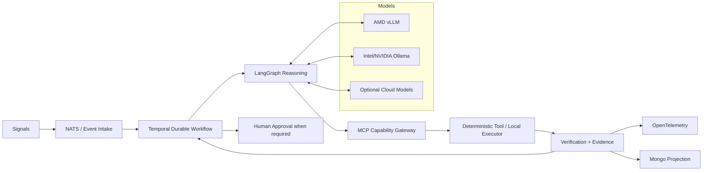

# InnerOS Agentic Platform

> **Durable local-first agent operations for real systems.**

InnerOS turns fragile AI-agent loops into durable, observable workflows with bounded tools, recoverable execution, local/cloud model routing, human approval, and verifiable evidence.

It is designed for the part that agent demos usually skip: **what happens after the chat window closes, a worker crashes, a model goes offline, permissions drift, or two agents try to do the same job.**

InnerOS is open source under the **Apache License 2.0** and commercially supported by InnerChispa LLC.

---

## Why InnerOS exists

Running multiple AI agents creates a second operational problem: someone still has to supervise the agents.

Real systems need to answer questions such as:

- Who owns this task?
- What happens if a worker dies?
- Can the task survive a model outage?
- Which tool is actually authorized?
- Did the agent really execute the action, or only say it did?
- Can a human approve only the sensitive step?
- Can we reconstruct what happened later?
- Is the deployed runtime actually running the code in `main`?

InnerOS is built around those failure modes.

The operating loop is:

```text
signal
  -> relevance
  -> durable workflow
  -> reasoning
  -> bounded capability
  -> execution
  -> verification
  -> evidence
  -> recovery or completion
  -> human escalation only when required
```

The scarce resource is not tokens. It is **human attention**.

---

## Architecture

InnerOS separates responsibilities instead of asking one giant agent loop to do everything.



### Responsibility boundaries

| Layer | Responsibility |
|---|---|
| **Temporal** | durable lifecycle, retries, waits, cancellation, recovery |
| **LangGraph** | agent reasoning and state graphs |
| **MCP** | bounded capabilities and tool access |
| **NATS JetStream** | durable event distribution |
| **MongoDB** | projections, evidence metadata, operational search |
| **OpenTelemetry** | traces and correlation |
| **vLLM / Ollama** | local-first inference and failover |
| **Human approval** | high-impact decision boundary |
| **Git `main`** | canonical software history |

The goal is to prevent five different subsystems from each inventing their own version of task state. Humanity has already suffered enough from distributed truth.

---

## What InnerOS is built to solve

### Durable agent execution

Tasks outlive individual prompts, sessions, workers, and model calls.

### Local-first AI

InnerOS can route inference across local heterogeneous hardware, including AMD/vLLM and Ollama-based nodes, with cloud models as optional participants rather than mandatory dependencies.

### Bounded tools

Agents do not receive an unlimited universe of tools. MCP capabilities can be scoped by identity, task, policy, and risk.

### Human-in-the-loop without human-in-every-loop

Sensitive actions can wait for explicit approval while low-risk operations continue autonomously.

### Evidence-driven completion

A task is not complete because an agent says "done". Completion should be backed by execution evidence, tests, state transitions, and the canonical merged code when software changes are involved.

### Recovery

Worker crashes, model failures, stale locks, retries, and resumable workflows are treated as normal operational conditions.

### Multi-agent coordination

Agents can collaborate without using branches, inbox messages, or timestamps as substitutes for durable execution state.

---

## Current platform foundations

The public `main` branch already includes work for:

- Temporal OSS durable task execution;
- LangGraph integration;
- multi-queue Temporal workers;
- circuit-breaker behavior;
- Docker ephemeral execution sandboxing;
- coordination liveness and durable spine support;
- NATS JetStream integration;
- OpenTelemetry context propagation;
- local AMD vLLM to Ollama fallback;
- bounded execution and approval patterns;
- repository/task lifecycle convergence;
- OAuth and MCP profile hardening;
- agent consumer recovery and autonomous task claiming.

The project is still pre-1.0. Interfaces and operational boundaries are being actively simplified and converged.

See [ROADMAP.md](ROADMAP.md).

---

## Quick start

### Requirements

- Linux recommended
- Python 3.12+
- Git
- MongoDB for the full persistent path
- optional Temporal/NATS services depending on the subsystem being tested
- provider credentials only for integrations you actually enable

### Clone

```bash
git clone https://github.com/Rafa-Innerchispa/innerops-agentic-platform.git
cd innerops-agentic-platform/platform
```

### Environment

```bash
python3 -m venv venv
source venv/bin/activate
pip install -r requirements.txt
cp .env.example .env
```

The public `.env.example` uses sanitized placeholders. Do not commit credentials, customer data, or production topology.

### Start the core API

```bash
./run.sh
```

Default local API port:

```text
8101
```

### Start the MCP surface

```bash
./run_mcp.sh
```

Default MCP port:

```text
8102
```

### Verify

```bash
curl http://127.0.0.1:8101/status
```

### Tests

```bash
python3 -m unittest discover -s platform/tests -p 'test_*.py'
```

Focused subsystem tests are preferred while the public clean-clone path is being hardened.

---

## Open source and commercial use

InnerOS Agentic Platform is licensed under the **Apache License 2.0**.

You may use, modify, redistribute, embed, and use the open-source core commercially under the license terms.

InnerChispa may also provide paid services and products around InnerOS, including:

- architecture and deployment;
- managed operations;
- enterprise support and SLAs;
- integrations and migration;
- private customer-specific modules;
- security hardening;
- observability and recovery operations;
- training;
- hardware and appliance deployments;
- commercial vertical products built on the open core.

The open repository contains reusable platform code and public documentation. Credentials, customer data, private infrastructure topology, production secrets, and private business modules do not belong here.

See:

- [LICENSE](LICENSE)
- [NOTICE](NOTICE)
- [Open Source and Commercial Model](docs/OPEN_SOURCE_AND_COMMERCIAL_MODEL.md)
- [Why InnerOS is Open Source](docs/WHY_OPEN_SOURCE.md)

---

## Project governance

InnerOS uses `main` as the canonical integration branch.

A code task is considered complete only when the accepted change is:

1. implemented in isolation;
2. tested;
3. reviewed with evidence;
4. merged to `main`;
5. associated with an exact SHA;
6. reconciled with runtime state when deployment is part of the task.

Useful work should not live indefinitely in stale branches or detached worktrees.

See:

- [CONTRIBUTING.md](CONTRIBUTING.md)
- [GOVERNANCE.md](GOVERNANCE.md)
- [Branch and Release Policy](docs/BRANCH_AND_RELEASE_POLICY.md)
- [SECURITY.md](SECURITY.md)

---

## For developers and contributors

Useful contributions include:

- failure recovery;
- Temporal workflows;
- LangGraph reasoning patterns;
- MCP capability filtering;
- local inference routing;
- observability;
- security boundaries;
- reproducible integrations;
- documentation;
- clean-clone developer experience.

Please open a GitHub Issue before large architectural changes.

InnerOS deliberately avoids adding new schedulers, state stores, or orchestration layers unless they replace an existing responsibility rather than duplicate it.

---

## For hackathons, research, and demos

InnerOS works well as a reference project for:

- durable AI-agent orchestration;
- local-first AI infrastructure;
- human-in-the-loop systems;
- MCP security and capability routing;
- multi-model routing;
- resilient agent operations;
- observable autonomous workflows.

A strong demo should show **one closed operational loop**, not a tour of hundreds of tools:

```text
real signal
  -> durable workflow
  -> reasoning
  -> bounded tool
  -> interruption or failure
  -> recovery
  -> verification
  -> final evidence
```

See [Hackathon and Demo Brief](docs/HACKATHON_AND_DEMO_BRIEF.md).

---

## Project status

**Current target:** `v0.1.0 - Durable Local-First Agent Operations`

The first public release is being gated on:

- repository convergence;
- compact MCP gateway verification;
- clean-clone reproducibility;
- branch hygiene;
- secret/privacy audit;
- focused Temporal/LangGraph/MCP integration evidence.

See [CHANGELOG.md](CHANGELOG.md) and [Public Release Checklist](docs/PUBLIC_RELEASE_CHECKLIST.md).

---

## Documentation

- [Roadmap](ROADMAP.md)
- [Governance](GOVERNANCE.md)
- [Support](SUPPORT.md)
- [Security](SECURITY.md)
- [Contributing](CONTRIBUTING.md)
- [Open Source and Commercial Model](docs/OPEN_SOURCE_AND_COMMERCIAL_MODEL.md)
- [Launch and Release Guide](docs/LAUNCH_AND_RELEASE.md)
- [Hackathon and Demo Brief](docs/HACKATHON_AND_DEMO_BRIEF.md)
- [Agentic Defense](docs/AGENTIC_DEFENSE.md)
- [Architecture](docs/ARCHITECTURE.md)
- [The Story](docs/THE_STORY.md)

---

## Citation

If you use InnerOS in research, technical writing, comparisons, or demos, see [CITATION.cff](CITATION.cff).

---

## Principle

> **InnerOS notices what matters, does what it safely can, recovers when things fail, proves what happened, and brings the human back only when the human is actually needed.**
