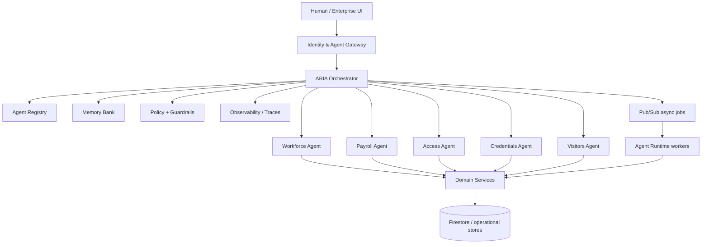

# InnerOps Fortified Enterprise Fleet

## System boundary

InnerOps treats enterprise operations as a set of bounded modules coordinated by ARIA. The agentic layer does not own business truth. Deterministic services and databases remain authoritative for payroll, attendance, credentials, access and visitor records.

## Agent contract

Every specialist agent must declare: immutable agent ID, version, owner, domain, allowed tools, required scopes, input/output schema, model policy, approval policy and observability attributes.

## Runtime rules

- Least privilege by default.
- Agent plans are suggestions until a tool contract authorizes execution.
- Destructive or financially sensitive operations require explicit policy and, where appropriate, human approval.
- Every tool call receives correlation and trace identifiers.
- Retries must be idempotent.
- Agent memory is not an authority for transactional business state.

## Google Cloud target

- Cloud Run: gateway, ARIA runtime and bounded specialist services.
- Firestore: agent registry, task state and approved memory metadata.
- Pub/Sub: asynchronous execution, event fan-out and resilient retries.
- Secret Manager: runtime secrets; never repository files.
- Cloud Logging/Trace-compatible telemetry: execution evidence and latency.
- Gemini through Google ADK or Google GenAI SDK for reasoning/orchestration workloads.

## Fortification

The security boundary validates identity, authorization, tool schema, payload sensitivity and output policy before an action crosses into a domain service. Prompt injection or model output alone can never grant a capability.
